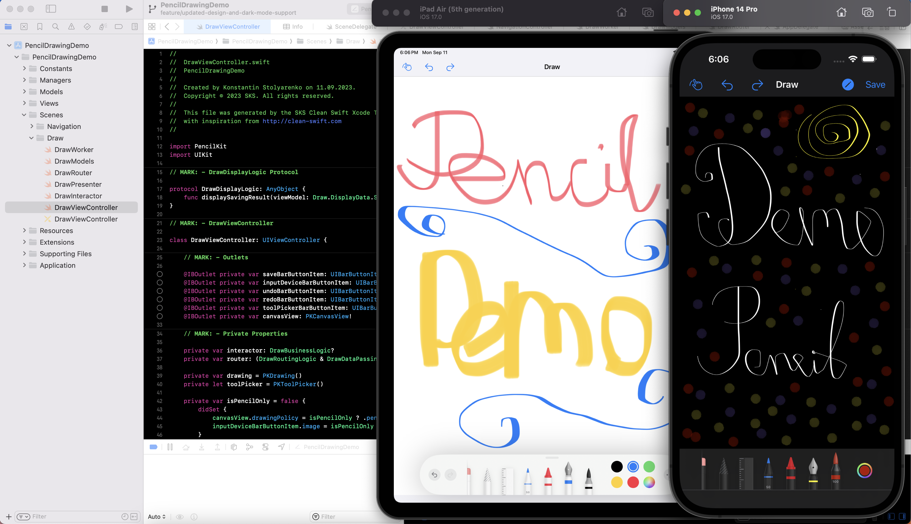

# Pencil Drawing UIKit Demo like Sketchbook
An example of drawing application using the PencilKit framework similar to the Sketchbook App.
Developed entirely natively using Swift and UIKit based on Clean Swift Architecture.

## Installation
The project does not require additional installation, as no dependency manager is currently used.

## Build
No additional setup is needed. Build project using Xcode.

## Technologies
* Swift
* UIKit
* PencilKit

## Versions
* Xcode 14.3.1 (latest)
* Swift 5.8.1 (latest)

## Branches
GitFlow is strictly enforced on this repository. [GitFlow](https://www.atlassian.com/git/tutorials/comparing-workflows/gitflow-workflow)

### Branch overview
* master
* develop
* feature/name
* hotfix/name

### Git Flow:
feature -> develop -> master

## Architecture
We use one of the most advanced and high-level architectures for iOS projects called: Clean Swift. 
Clean Swift (shortly VIP) is Uncle Bob's Clean Architecture adapted to iOS and macOS projects. 

In our project each screen is a module called a Scene, and is divided into 6 entities:
* View
* Interactor
* Presenter
* Router
* Model
* Worker

Each Scene will have their independent storyboard file if need and looks like this: 
*(As an exmaple Welcome Screen was taken)*

* WelcomeWorker.swift
* WelcomeModels.swift
* WelcomeRouter.swift
* WelcomePresenter.swift
* WelcomeInteractor.swiftw
* WelcomeViewController.swift
* WelcomeViewController.storyboard

In addition to the Scenes in the project, there are also general categories that are shared/common for all Scenes, such as: Constants, Managers, Services, Models, Views, Extensions and Resources.

You can read more about Clean Swift [here](https://clean-swift.com/).

## License
Copyright © November 21, 2025 Konstantin Stolyarenko. All rights reserved.
